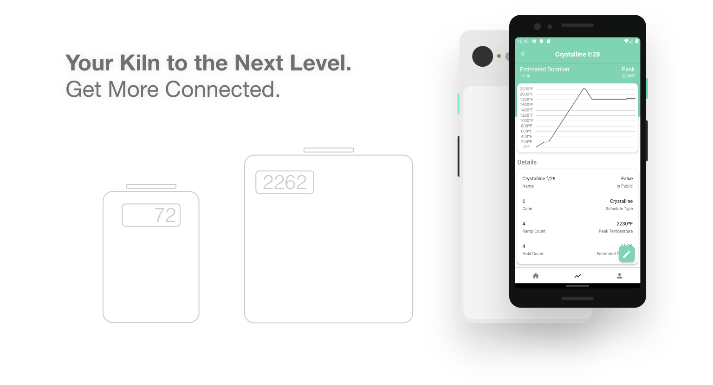

# SmartKiln



<p align="left">
  <a href="https://testflight.apple.com/join/0vnadjan" target="_blank">
    
  </a>
  <!-- <a target="_blank">
    
  </! -->
</p >

SmartKiln brings a smarter, better, more connected ecosystem to all your kilns. With SmartKiln you have full access of the network to all of your connected kilns.

SmartKiln provides all and more of the following features:

- **Remotely control kilns from anywhere**
- **Add, edit, and sync multiple firing schedules from one place**
- **View real-time kiln data and charted temperature data points for multiple kilns**
- **Easily see current state of all linked kilns**
- **Edit kiln temperature display types and temperature offsets**
- **Easily switch between displaying Celsius and Fahrenheit temperatures**

Once you've downloaded the app for your device, below are all the details for setting up your own kiln controller powered by the SmartKiln ecosystem.

<br />

# Smart Kiln Hardware

This is the new complete hardware application for the Smart Kiln project which supersedes the <a href="https://github.com/ZachJMoore/smart-kiln-standalone" target="_blank">smart-kiln-standalone</a> repository which was used for handling the logic behind firing a kiln, and <a href="https://github.com/ZachJMoore/smart-kiln-standalone-ui" target="_blank">smart-kiln-standalone-ui</a> repository which was used for the UI.

**Kiln Interactions**

The switch to React Native has taken place and the apps can be found at the links above. All of the interactions are handled through mobile, as well as eventually a web app.

<br />

## Getting Started

After cloning the project or downloading the [latest release](https://github.com/ZachJMoore/smart-kiln-hardware/releases), make sure to rename .env.example to .env. You can do so with the following command from the root project directory:

```
$ mv .env.example .env
```

Or for those that love one liners for getting started:
```
$ git clone https://github.com/ZachJMoore/smart-kiln-hardware.git && cd smart-kiln-hardware && mv .env.example .env
```

<br />

## Hardware & Wiring

Each SmartKiln software component that deals with hardware has a README with wiring and links to hardware information.

### Parts and Other:
- Raspberry Pi
- Power Supply
- Raspberry Pi Case
- SD Card
- [Relays](/app/components/Kiln/lib/Relays/README.md)
- [Thermocouples and Amplifiers](/app/components/Kiln/lib/ThermoSensor/README.md)
- [Displays](/app/components/Display/README.md)

<br />

## Software Setup

This project includes a WiFi Manager under the hood that is based on this for controlling wlan vs ap modes. It currently needs more testing and is not enabled. The WiFi mode switching is based on this answer on [StackExchange](https://raspberrypi.stackexchange.com/questions/93311/switch-between-wifi-client-and-access-point-without-reboot/93312#93312).

Even though it as not enabled, the install instructions for the WiFi Manager dependencies are listed below for future use, documentation, and testing purposes.

### Dependencies:

The follow is the basics of what we need: Node, SPI, I2C, ZeroConf, forever & forever-service, node_modules, and optional systemd-networkd helper tools & systemd-networkd setup.

#### Installing Node

**Node for Pi Zero W:**
```
    $ curl -o node-v9.7.1-linux-armv6l.tar.gz https://nodejs.org/dist/v9.7.1/node-v9.7.1-linux-armv6l.tar.gz && tar -xzf node-v9.7.1-linux-armv6l.tar.gz && sudo cp -r node-v9.7.1-linux-armv6l/* /usr/local/
```

**Node for Pi 3B+:**
```
    $ curl -sL https://deb.nodesource.com/setup_10.x | sudo -E bash -
    $ sudo apt-get install -y nodejs
```

#### SPI, I2C:

**Command Line:**
```
    $ sudo raspi-config
    -> Interfacing Options -> SPI
    -> Interfacing Options -> I2C
```

**Boot Config**

If you'd rather enable these from the very start, in your sd card after installing raspbian, edit /boot/config.txt and append the following lines:
```
    dtparam=spi=on
    dtparam=i2c_vc=on
```

#### ZeroConf

We also need helper tools for ZeroConf. Run the following commands:

```
    $ sudo apt-get install libavahi-compat-libdnssd-dev
```

#### forever & forever-service

Used for keeping everything alive after reboots or bugs happen

```
    $ npm install -g --save forever forever-service
```

#### Node Modules

Thats it for required dependencies! Run the following command and move onto the usage section.

```
    $ npm install 
```

<br/>
<hr>
<br />

**OPTIONAL:** Not required in the current version.

#### systemd-networkd:

Just a few helper tools. Run the follow:

```
    $ sudo apt install rng-tools
```

#### systemd-networkd Setup:

There is some setup before we can use systemd-networkd

**Automatic**

smart-kiln-hardware provides a setup script which tries to copy and edit all the necessary files for you.

```
    $ sudo npm run setup
```

**Manual**

If you prefer to do it manually or run into issues, you can follow the StackExchange answer linked above.

<br />

## Usage:

I would suggest running the app with `npm start` first to make sure everything is configured correctly, then proceed to following:

**Install & Start**

```
$ npm run service:install
```

**Stop & Delete***
```
$ npm run service:delete
```

### Commands to interact with the service:
- Start   - "sudo service smart-kiln-hardware start"
- Stop    - "sudo service smart-kiln-hardware stop"
- Status  - "sudo service smart-kiln-hardware status"
- Restart - "sudo service smart-kiln-hardware restart"
