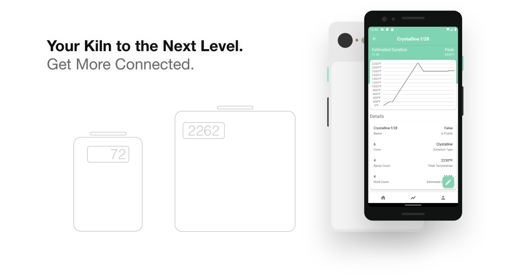

# SmartKiln Beta



<p align="left">
  <a href="https://testflight.apple.com/join/0vnadjan" target="_blank">
    
  </a>
  <a href="https://play.google.com/store/apps/details?id=com.smartkilnrnb&ah=JB0JJlthaT0pzv7eerekxm7VE1c" target="_blank">
    
    </a>
</p >

SmartKiln brings a smarter, better, more connected ecosystem to all your kilns. With SmartKiln you have full access through the cloud to all of your connected kilns.

The SmartKiln beta currently provides all and more of the following features:

- **Remotely control kilns from anywhere**
- **Add, edit, and sync multiple firing schedules from one place**
- **Unlimited firing schedule ramps**
- **View real-time kiln data and charted temperature data points for multiple kilns**
- **Easily see the current state of all linked kilns**
- **Edit kiln temperature display types and temperature offsets**
- **Easily switch between displaying Celsius and Fahrenheit**

After downloading the SmartKiln app for your device, follow all the steps below to set up your kiln controller powered by the SmartKiln ecosystem.

<br />

# Smart Kiln Hardware

This is the new complete hardware application for all SmartKiln devices and supersedes all past codebases up to this point.

The switch to React Native has taken place for all interactions between you and your kiln and the apps can be found at the links above. All kiln interactions are currently handled through mobile, as well as eventually a web app.

### Where do I get a kiln controller?

Currently, while in beta, the only way to get access to a SmartKiln controller is to build it yourself. Listed below is everything you need to get started, but if you run into any issues, please see the [Issues & Bug Reports](#issues-&-bug-reports) section.

### What if I can't build my own?

If you don't feel comfortable or can't make your own, you can sign up for our waitlist at https://smartkiln.net and we will let you know when our official kiln controller is available.

<br/>

<a href="https://github.com/ZachJMoore/passeljs">
  <small>SmartKiln Hardware is Powered by Passel.js</small>
</a>

<hr/>

<details>
<summary>**Disclaimer**</summary>

<br />

The SmartKiln is provided by Zach Moore and the maintainers "as is" and "with all faults." Zach Moore and the maintainers make no representations or warranties of any kind concerning the safety, suitability, lack of viruses or bugs, inaccuracies, typographical errors, or other harmful components of the SmartKiln. There are inherent dangers in the use of any software and hardware, and you are solely responsible for determining whether the SmartKiln is compatible with your kiln and hardware, as well as any other software installed on your hardware. You are also solely responsible for the protection of yourself, kilns, hardware, and backup of your data. Zach Moore and the maintainers will not be liable for any damages you may suffer in connection with using, modifying, or distributing the SmartKiln. By using any part of the SmartKiln, you accept sole responsibility of any and all damage or harm caused by yourself or SmartKiln products.

</details>
<hr/>

<br />

## Getting Started

<details>
<summary>Expand Getting Started</summary>

<br />

To get started, download the [latest release](https://github.com/ZachJMoore/smart-kiln-hardware/releases), make sure to rename .env.example to .env. You can do so with the following command from the root project directory:

```
$ mv .env.example .env
```

Look over the .env configuration and ensure that all the settings are correct. The only section you have to worry about if you only intend to install the required dependencies are the hardware versions. There are instructions below for configuring and correctly setting your version numbers.

Please follow, in full, each section below to set up your hardware and the SmartKiln software.

</details>

<br />

## Hardware & Wiring

<details>
<summary>Expand Hardware & Wiring</summary>

<br />

Each SmartKiln software component that deals with hardware has a README with wiring and hardware information.

### Parts and Wiring README's

- Raspberry Pi (already setup with Raspbian)
- Raspberry Pi Case
- Power Supply
- SD Card
- [Relays](/app/components/Kiln/lib/Relays/README.md)
- [Thermocouples and Amplifiers](/app/components/Kiln/lib/ThermoSensor/README.md)
- [Displays](/app/components/Display/README.md)

</details>

<br />

## Software Setup

<details>
<summary>Expand Software Setup</summary>

<br />

This project includes a WiFi Manager under the hood that is used for controlling WLAN vs ap modes. It currently needs more testing and is not enabled. The WiFi mode switching is based on this answer from [StackExchange](https://raspberrypi.stackexchange.com/questions/93311/switch-between-wifi-client-and-access-point-without-reboot/93312#93312).

Even though it as not enabled, the install instructions for the WiFi Manager dependencies are listed below for future use, documentation, and testing purposes.

### Dependencies

The following are the basics of what we need: Node, SPI, I2C, ZeroConf, forever & forever-service, node_modules, and optional systemd-networkd helper tools & systemd-networkd setup.

#### Installing Node

**Node for Pi Zero W:**

```
    $ curl -o node-v9.7.1-linux-armv6l.tar.gz https://nodejs.org/dist/v9.7.1/node-v9.7.1-linux-armv6l.tar.gz && tar -xzf node-v9.7.1-linux-armv6l.tar.gz && sudo cp -r node-v9.7.1-linux-armv6l/* /usr/local/
```

**Node for Pi 3B+:**

```
    $ curl -sL https://deb.nodesource.com/setup_10.x | sudo -E bash -
    $ sudo apt-get install -y nodejs
```

#### SPI, I2C

**Command Line:**

```
    $ sudo raspi-config
    -> Interfacing Options -> SPI
    -> Interfacing Options -> I2C
```

**Boot Config**

If you'd rather enable these from the very start, in your sd card after installing raspbian, edit /boot/config.txt and append the following lines:

```
    dtparam=spi=on
    dtparam=i2c_arm=on
```

#### ZeroConf

We also need helper tools for ZeroConf. Run the following commands:

```
    $ sudo apt-get install libavahi-compat-libdnssd-dev
```

#### forever & forever-service

Used for keeping everything alive after reboots or bugs happen

```
    $ npm install -g --save forever forever-service
```

#### Node Modules

That all for required dependencies! Run the following command and move onto the usage section.

```
    $ npm install
```

<br/>
<hr>
<br />

**OPTIONAL:** Not required in the current version.

<details>
<summary>Expand WiFi Manager Setup</summary>

<br />

#### systemd-networkd

Just a few helper tools. Run the follow:

```
    $ sudo apt install rng-tools
```

#### systemd-networkd Setup

There is some setup before we can use systemd-networkd

**Automatic**

smart-kiln-hardware provides a setup script that tries to copy and edit all the necessary files for you.

```
    $ sudo npm run setup
```

**Manual**

If you prefer to do it manually or run into issues, you can follow the StackExchange answer linked above. Although as the project changes, the setup script applies addition steps to make everything work. It is recommended not to do this manually.

</details>

</details>

<br />

## Deploy Instructions

<details>

<summary>Expand Deploy Instructions</summary>

<br />

Before first deploying, make sure to run the app with `npm start` to make sure everything is configured correctly, then proceed to the following:

**Install & Start**

```
$ npm run service:install
```

**Stop & Delete**

```
$ npm run service:delete
```

### Commands to interact with the service

- Start - "sudo service smart-kiln-hardware start"
- Stop - "sudo service smart-kiln-hardware stop"
- Status - "sudo service smart-kiln-hardware status"
- Restart - "sudo service smart-kiln-hardware restart"

</details>

<br />

## Linking & Usage

<details>
<summary>Expand Linking & Usage</summary>

<br />

All kilns are currently being strictly manually linked to your account while in the beta. If you have downloaded the SmartKiln app, created an account, set up your SmartKiln controller, and have all the appropriate hardware correctly assembled and attached to your kiln, you can follow the steps below:

- Login to the email you used for your account at SmartKiln
- Compose an email to <a href="mailto:contact@smartkiln.net">contact@smartkiln.net</a>
- Set the subject title to: `SmartKiln Link Request`
- In the email body, please include the following in order
  - **Kiln UUID & ID Number**. Your kiln UUID can be found, from the directory you started the SmartKiln hardware app in, at the following file `app/storage/internal/Authentication/state.json`. In this file, your UUID and ID are under the account section. If there is no information in this section, your kiln has not connected to our servers yet and most likely is just not connected to a network, behind a firewall, or is incorrectly configured.
  - **User Account Identification**. You can find your account identification in the SmartKiln app settings. As of 10/3/2019, this information is listed in the top left. It will be in the following format: "number"."Your Name", for example, "1.Smart Kiln".

After receiving this information, we will make the changes to your account on our end and will email you once this has been completed. You will be able to find your kiln listed in the SmartKiln app under the home page. If you don't immediately see it, try refreshing or restarting the app.

</details>

<br />

## Issues & Bug Reports

https://smartkiln.net/support-page

## SmartKiln Privacy Policy

https://smartkiln.net/privacy-policy

## License

smart-kiln-hardware uses the [Creative Commons Attribution-NonCommercial-ShareAlike 4.0 International](https://creativecommons.org/licenses/by-nc-sa/4.0/) license and the software can be shared and adapted as long as all terms are met. Before contributing or using this software in any regard, ensure that you read the [license](https://creativecommons.org/licenses/by-nc-sa/4.0/legalcode) in full.

See the main three license requirements below:

- **Attribution** — You must give appropriate credit, provide a link to the license, and indicate if changes were made. You may do so in any reasonable manner, but not in any way that suggests the licensor endorses you or your use.

- **NonCommercial** — You may not use the material for commercial purposes.

- **ShareAlike** — If you remix, transform, or build upon the material, you must distribute your contributions under the same license as the original.
