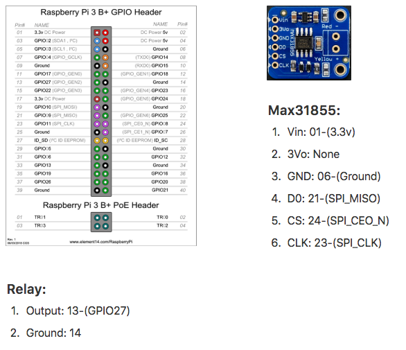

## Thermocouples and Amplifiers

There are different versions of thermocouple amplifiers and setup configurations for the smart kiln. Described below is what each version number stands for and which string should be passed to the ThermoSensor constructor.

The only current supported thermocouple type is "K".

- "v1": This is a Max31855 board which communicates over spi with the raspberry pi. Wiring can be found above. Part can be found <a href="https://www.amazon.com/gp/product/B00SK8NDAI/ref=oh_aui_detailpage_o00_s01?ie=UTF8&psc=1">here</a>.

- "v2": This is a dual Max31855 setup which uses gpio 23 and 24 for a software chip select, otherwise the wiring is the same as v1 (chips share the same lanes and CS is the only difference).
